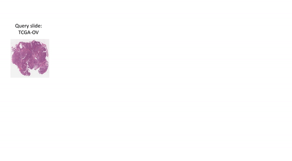

FAIRY
===========
Fast and Scalable Image Search for Histology

[[arXiv]](https://arxiv.org/abs/2107.13587)

***TL;DR:** FAIRY is a histology whole slide image search pipeline that scales with O(1) and maintains constant search speed regardless of the size of the database. FAIRY uses self-supervised deep learning to encode meaningful representations from WSIs and a Van Emde Boas tree for fast search, followed by an uncertainty-based ranking algorithm to retrieve similar WSIs. We evaluated FAIRY on multiple tasks and datasets with over 22,000 patient cases spanning 56 disease subtypes. We additionally demonstrate that FAIRY can be used to assist with the diagnosis of rare cancer types where sufficient cases may not be available to train traditional deep models.*
<p align="center">
    
</p>

## Pre-requisites:
* Linux (Tested on Ubuntu 18.04)
* NVIDIA GPU (NVIDIA GeForce 2080 Ti) 
* Python (3.7.0), OpenCV (3.4.0), Openslide-python (1.1.1) and Pytorch (1.5.0)
For more details, please refer to the [installtion guide](INSTALLATION.md).

## Usage
The steps below show how to build FAIRY pipeline in your own dataset. To reproduce the results in our paper, please refer to the reproducibility section.
### Preprocessing
#### Step 1: Slide preparation
Make the `./DATA` folder, download whole slide images there, and then organize them into the following structure. Note that we ignore slides without specific resolution. 
```bash
DATA
└── WSI
    ├── SITE
    │   ├── DIAGNOSIS
    │   │   ├── RESOLUTION
    │   │   │   ├── slide_1
    │   │   │   ├── slide_2
    │   │   │   ├── slide_3
```
#### Step 2: Segmentation and Patching
We use the [CLAM toolbox](https://github.com/mahmoodlab/CLAM/blob/master/docs/README.md) to segment and patch whole slide images. Simply run:
```
python create_patches_fp.py --source ./DATA/SITE/DIAGNOSIS/RESOLUTION/ --step_size STEP_SIZE --patch_size PATCH_SIZE --seg --patch --save_dir ./DATA/PATCHES/SITE/DIAGNOSIS/RESOLUTION
```
We set `PATCH_SIZE` and `STEP_SIZE` to 1024 for 20x slide and to 2048 for 40x slide. After segmentation and patching, the `DATA` directory will look like the following
```bash
DATA/
├── PATCHES
│   └── SITE
│       └── DIAGNOSIS
│           └── RESOLUTION
│               ├── masks
│               ├── patches
│               ├── process_list_autogen.csv
│               └── stitches
└── WSI

```
#### Step 3: Mosaic generation
The following script generates the mosaics for each whole slide image (Please download the checkpoint trash_lgrlbp.pkl from the link in the reproducibility section):
```
python extract_mosaic.py --slide_data_path ./DATA/WSI/SITE/DIAGNOSIS/RESOLUTOIN --slide_patch_path ./DATA/PATCHES/SITE/DIAGNOSIS/RESOLUTION/patches/ --save_path ./DATA/MOSAICS/SITE/DIAGNOSIS/RESOLUTION
```

Once mosaic generation finsihes, there are some rare cases contain artifacts (i.e., pure white patch) result from mosaic generation. We run the following script to remove the artifacts
```
python artifacts_removal.py --site_slide_path ./DATA/WSI/SITE/  --site_mosaic_path ./DATA/MOSAICS/SITE
```
The `DATA` directory should look like below. We only use the mosaics in the `coord_clean` folder for all experiments in the paper.
```bash
DATA/
├── MOSAICS
│   └── SITE
│       └── DIAGNOSIS
│           └── RESOLUTION
│               ├── coord
│               ├── coord_clean
├── PATCHES
└── WSI
```
#### Step 4 FAIRY database construction
To buid the database for each anatomic site, run `build_index.py` as below
```
python build_index.py --site SITE
```
After the script completes, it creates a database folder organized like
```bash
DATABASES/
└── SITE
    ├── index_meta
    │   └── meta.pkl
    └── index_tree
        └── veb.pkl
```
The `index_meta/meta.pkl` stores the meta data of each integer key in `index_tree/veb.pkl`. 
It also creates a folder `LATENT` that store the mosaic latent code from VQ-VAE and texture features from densenet which has the structure below
```bash

DATA/LATENT/
├── SITE
│   ├── DIAGNOSIS
│   │   ├── RESOLUTION
│   │   │   ├── densenet
│   │   │   │   ├── slide_1.pkl
│   │   │   │   └── slide_2.pkl
│   │   │   └── vqvae
│   │   │       ├── slide_1.h5
│   │   │       └── slide_2.h5

```
#### Step 5 Search the whole database
Run the script below to get each query's results in the database.
```
python main_search.py --site SITE --db_index_path ./DATABASES/SITE/index_tree/veb.pkl --index_meta_path ./DATABASES/SITE/index_meta/meta.pkl
```

It will store the results for each query and the time it takes in two separate folders, which are
```bash
QUERY_RESULTS/
└── SITE
    └── results.pkl
QUERY_SPEED/
├── SITE
│   └── speed_log.txt
```
#### Step 6 Evaluation
Run the `eval.py` to get the performance results which will direclty print on the screen when finish.
```bash
python eval.py --site SITE --result_path QUERY_RESULTS/SITE/results.pkl
```

### Optional: FAIRY for patch retrieval
If you would like to use FAIRY for patch retrieval task, please organize your data into the structure below
```bash
./DATA_PATCH/
├── All
├── summary.csv
```
where all patches files are in the folder `All` and the summary.csv file stores patch name and label in the format below
```bash
patch1,y1
patch2,y2
patch3,y3
...
```
Once prepared, run the following:

Build database:
```
python build_index_patch.py --exp_name EXP_NAME --patch_label_file ./DATA_PATCH/summary.csv --patch_data_path ./DATA_PATCH/All
```
where the `EXP_NAME` is a customized name of this database. You can reproduce our kather100k results by setting `EXP_NAME=kather100k`. One thing to note is that you should implement your method start from line 236 to scale your patch to 1024x1024 if you use your own patch data.


Search:
```
python main_search_patch.py --exp_name EXP_NAME --patch_label_file ./DATA_PATCH/summary.csv --patch_data_path ./DATA_PATCH/All --db_index_path DATABASES_PATCH/EXP_NAME/index_tree/veb.pkl --index_meta_path DATABASES_PATCH/EXP_NAME/index_meta/meta.pkl
```

Evaluation:
```
python eval_patch.py --result_path QUERY_RESULTS/PATCH/EXP_NAME/results.pkl
```

## Reproducibility
To reproduce the results in our paper, please download the checkpoints, preprocessed latent code and pre-build databases from the [link](https://drive.google.com/drive/folders/1HClR9ms737qx0d22ia0VQqPLuTIu1UgN?usp=sharing). The preprocess latent codes and pre-build databases are results directly from **Step 1-4** if you start everything from scratch. Once downloaded, unzip the DATABASES.zip and LATENT.ZIP  under `./FISH/DATA/` and `./FISH/` respectively.
The folder structures should like the ones in **Step 4**. Run the command in **Step 5** and **Step 6** to reproduce the results in each site. 

To reproduce the anatomic site retrieval, run
```
python main_search.py --site organ --db_index_path DATABASES/organ/index_tree/veb.pkl --index_meta_path DATABASES/organ/index_meta/meta.pkl
```
and
```
python eval.py --site organ --result_path QUERY_RESULTS/organ/results.pkl
```

Note that the speed results could be different from paper if your CPU is not equivalent to ours (AMD368Ryzen Threadripper 3970X  32-Core Processor).
